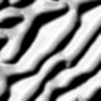
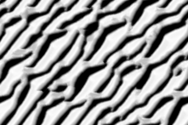
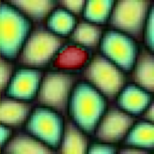
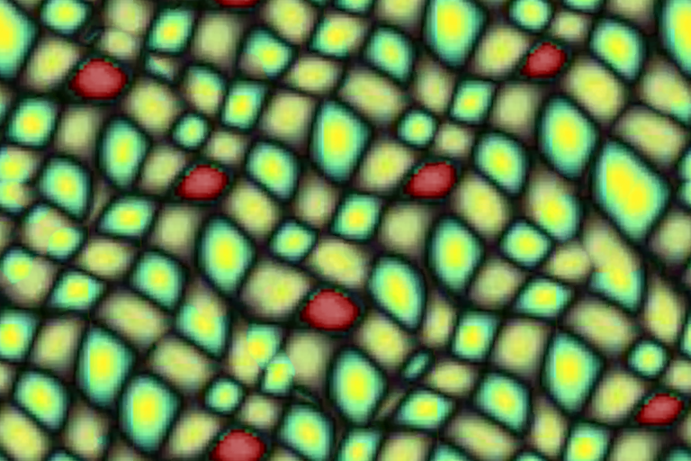

# Texture Synthesis

This an implementation in C++ of the paper : [Parallel Controllable Texture Synthesis](http://hhoppe.com/paratexsyn.pdf).
The goal is to design an algorithm that given a small exemplar image produce a big image with the same structure as the small image.
The created image has to be different from the input image and the output should also not repeat.

You can compile the code with the Makefile by typing
```
make
```

Then to execute the algorithm you have to type:
```
./main [filename] [-c]
```
The first parameter is the name of the image given in input.
The argument `-c` is optional and if it is given then some images called coherence maps are computed. It may take a while.

Here are two examples of images created by the algorithm :  

 

 